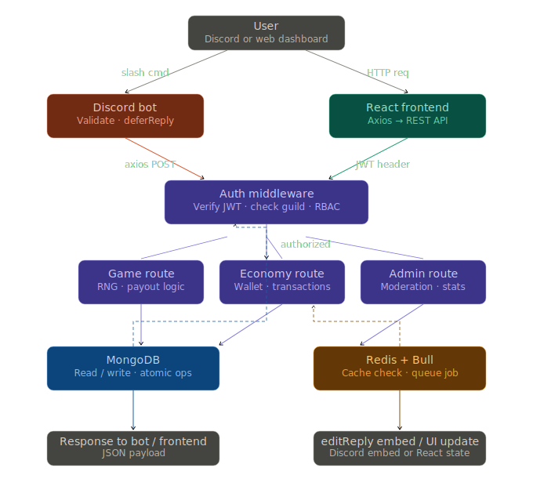
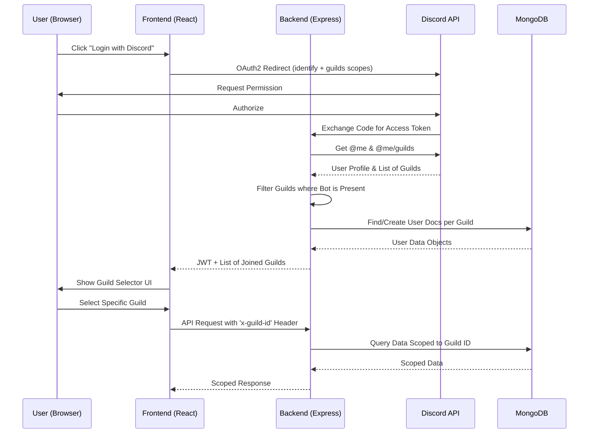

## Backend Architecture

```mermaid
sequenceDiagram
    participant User as User (Browser)
    participant Front as Frontend (React)
    participant Back as Backend (Express)
    participant DAPI as Discord API
    participant DB as MongoDB

    User->>Front: Click "Login with Discord"
    Front->>DAPI: OAuth2 Redirect (identify + guilds scopes)
    DAPI->>User: Request Permission
    User->>DAPI: Authorize
    DAPI->>Back: Exchange Code for Access Token
    Back->>DAPI: Get @me & @me/guilds
    DAPI-->>Back: User Profile & List of Guilds
    Back->>Back: Filter Guilds where Bot is Present
    Back->>DB: Find/Create User Docs per Guild
    DB-->>Back: User Data Objects
    Back-->>Front: JWT + List of Joined Guilds
    Front->>User: Show Guild Selector UI
    User->>Front: Select Specific Guild
    Front->>Back: API Request with 'x-guild-id' Header
    Back->>DB: Query Data Scoped to Guild ID
    DB-->>Back: Scoped Data
    Back-->>Front: Scoped Response
```
